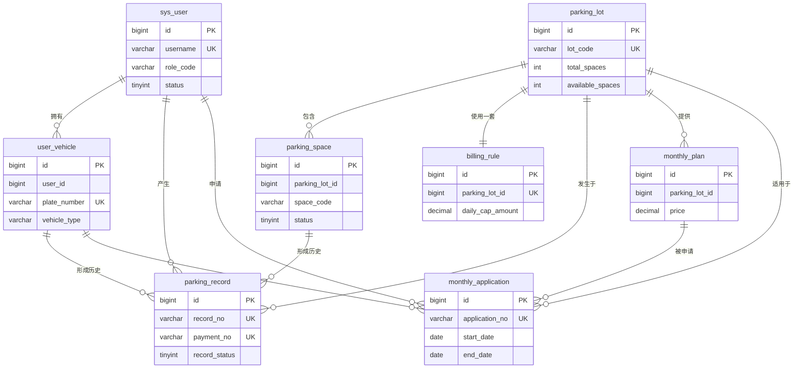

# 数据库关系说明

数据库：`long_parking_lite`；MySQL 8、InnoDB、`utf8mb4`。模型固定为 8 张表，全部采用逻辑外键，不创建物理外键，以降低后续数据迁移和历史记录保留难度。

## ER 图

## 表说明

| 表 | 中文名称与作用 | 主键 | 重要字段 | 索引 | 逻辑关联 | 典型查询 |
|---|---|---|---|---|---|---|
| `sys_user` | 系统用户；保存三种固定角色和账号状态 | `id` | `username`, `password`, `role_code`, `status` | 用户名、手机、邮箱唯一；角色状态联合索引 | 被车辆、停车记录、月租申请和审核人引用 | 登录、当前用户、用户管理 |
| `user_vehicle` | 车主绑定车辆，最多 3 辆 | `id` | `user_id`, `plate_number`, `vehicle_type`, `is_default`, `status` | 车牌唯一；用户和状态索引 | `user_id -> sys_user.id` | 我的车辆、车牌查车主、默认车辆 |
| `parking_lot` | 停车场基础信息及冗余车位统计 | `id` | `lot_code`, `business_*`, `total_spaces`, `available_spaces`, `status` | 停车场编码唯一；状态索引 | 拥有车位、计费规则、停车记录、套餐 | 公共列表、空闲统计、运营看板 |
| `parking_space` | 停车场直属车位，无停车区域层 | `id` | `parking_lot_id`, `space_code`, `space_type`, `status`, `current_plate_number` | 停车场+编号唯一；停车场+状态、当前车牌索引 | `parking_lot_id -> parking_lot.id` | 分配空闲车位、场内车牌定位 |
| `billing_rule` | 每个停车场唯一一套基础计费规则 | `id` | `parking_lot_id`, `free_minutes`, 三个金额字段, `status` | 停车场唯一；状态索引 | `parking_lot_id -> parking_lot.id` | 费用计算、停车场详情 |
| `parking_record` | 停车全生命周期；同时保存支付和人工放行信息 | `id` | `record_no`, 车辆/场/位ID, 进出时间, 金额, 支付/记录状态, `release_reason` | 记录号、支付号唯一；车牌、场、状态、入场时间等索引 | 用户、车辆、停车场、车位、操作员 | 场内查询、个人记录、计费、收入统计 |
| `monthly_plan` | 停车场月租商品 | `id` | `parking_lot_id`, `vehicle_type`, `month_count`, `price`, `status` | 停车场+状态、车辆类型索引 | `parking_lot_id -> parking_lot.id` | 套餐列表、申请时筛选 |
| `monthly_application` | 申请、审核结果及有效月租本身 | `id` | 用户/车辆/场/套餐ID, 日期范围, `status`, 审核字段 | 申请号唯一；车辆、场、状态、到期日和日期范围索引 | 用户、车辆、停车场、套餐、审核管理员 | 我的申请、待审核列表、有效月租校验 |

## 核心关系

- `sys_user 1:n user_vehicle`：车主可绑定多辆车，业务层限制最多 3 辆且仅一辆默认车。
- `parking_lot 1:n parking_space`：车位直接属于停车场，不存在停车区域表。
- `parking_lot 1:1 billing_rule`：`billing_rule.parking_lot_id` 唯一，一个停车场只有一条规则。
- `sys_user 1:n parking_record`、`user_vehicle 1:n parking_record`：临时未绑定车辆允许 `user_id`、`vehicle_id` 为空。
- `parking_space 1:n parking_record`：车位仅保存当前状态，停车记录保存历史占用。
- `parking_lot 1:n monthly_plan`。
- `sys_user 1:n monthly_application`、`user_vehicle 1:n monthly_application`、`monthly_plan 1:n monthly_application`。

## 业务写入流程

### 入场

1. 按车牌查找未结束记录并防重复入场。
2. 校验停车场营业、车位空闲、绑定车辆未停用。
3. 查询同车、同停车场、状态为通过且日期有效的 `monthly_application`，生成 `monthly_vehicle` 快照。
4. 同一事务创建 `parking_record`、将车位改为占用并写当前车牌、递减停车场空闲数。

### 临时车辆缴费和出场

计费读取停车记录与停车场唯一规则；支付将金额、`payment_status=1`、支付流水号和时间直接写回停车记录。正常出场必须已支付，同一事务更新出场时间/状态、释放车位、递增空闲数。

### 月租车辆出场

入场时已将有效月租结果固化到 `monthly_vehicle=1`。出场时校验月租语义，将 `payment_status=2`（无需支付）并直接释放车位。续期不另建流程；到期后重新申请。

### 月租审核

管理员只审核待审核记录。通过前在事务中再次检查同一车辆的已通过日期区间是否重叠；拒绝必须有 `audit_remark`。通过记录本身即为有效月租，不创建月租车辆表。

### 人工放行

必须填写 `release_reason`；将停车记录状态改为 4、写操作员和出场时间，并释放车位。没有异常放行表。

## 删除影响

- 用户和车辆建议逻辑禁用；存在历史停车记录或月租申请时不要物理删除。
- 占用中的车位禁止删除；有历史记录时优先停用。
- 停车场存在车位、规则、记录或套餐时禁止物理删除；应停用。
- 计费规则和套餐已被历史数据引用时保留记录，仅改变状态。
- 停车记录和已审核月租申请属于业务凭据，不允许普通管理接口删除。
- 因没有物理外键，以上限制必须由 Service 事务和冲突错误（HTTP 409）保证。
